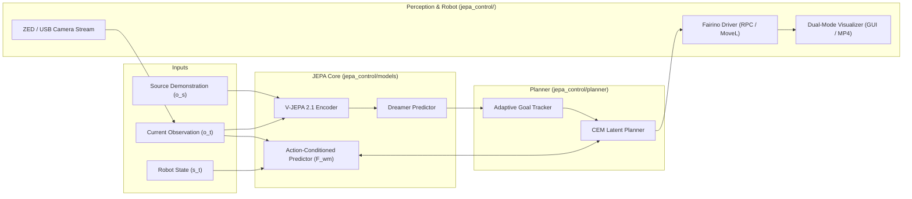

# JEPA World Model Control: One-Shot Visual Imitation Learning for Industrial Manipulators

[](https://opensource.org/licenses/Apache-2.0)
[](https://www.python.org/)
[](https://pytorch.org/)

**JEPA World Model Control** is a modular framework for cross-embodiment visual imitation learning on robotic manipulators (such as the Fairino FR10), built on Joint-Embedding Predictive Architectures (JEPA).

Rather than aligning embodiment-specific actions, the framework views demonstrations as implicit future goal specifications. Given a visual demonstration (from humans or other robots), the **Dreamer Predictor** infers embodiment-compatible future latent goals. The robot then executes continuous actions using a **Cross-Entropy Method (CEM) planner** operating within a learned **Action-Conditioned World Model**.

---

## 🏗️ Architecture Overview



---

## 📁 Repository Structure

```text
jepa-world-model-control/
├── config/
│   ├── deploy_config.yaml         # Model, checkpoint, and planner settings
│   └── fairino_robot.yaml         # Controller IP, speed limits, and coordinate bounds
├── jepa_control/
│   ├── models/                    # Core JEPA neural networks (V-JEPA, Dreamer, AC-Predictor)
│   ├── planner/                   # Latent-space Cross-Entropy Method optimizer
│   ├── perception/                # ZED/USB Camera streaming, image preprocessing & transforms
│   │   ├── camera.py              # Native PyZED / OpenCV camera interface
│   │   └── transforms.py          # Patch tokenization and ImageNet normalization
│   ├── robot/                     # Fairino FR10 XML-RPC driver with Dry-Run / Mock mode
│   │   ├── base_robot.py          # Abstract robot interface
│   │   └── fairino_driver.py      # Production Fairino RPC driver
│   └── pipeline/                  # Closed-loop execution engine & visualizer
│       ├── policy_runner.py       # End-to-end execution pipeline
│       └── visualizer.py          # Real-time multi-panel HUD & MP4 recorder
├── scripts/
│   ├── run_offline_rollout.py     # Unified policy execution script (Mock / Live + ZED)
│   └── test_fairino_dry_run.py    # Hardware test & mock validation script
├── pyproject.toml
└── requirements.txt
```

---

## 🚀 Installation & Quickstart

### 1. Clone the Repository
```bash
git clone https://github.com/vivek-v-ingle/jepa-world-model-control.git
cd jepa-world-model-control
```

### 2. Environment Setup

#### Option A: Standard Python Virtual Environment (`venv` + `pip`)
```bash
python3 -m venv .venv
source .venv/bin/activate
pip install -r requirements.txt
pip install -e .
```

#### Option B: Fast Setup using `uv`
```bash
uv venv
source .venv/bin/activate
uv pip install -r requirements.txt
uv pip install -e .
```

---

## 💻 Running the Pipeline

### Mode 1: Offline Simulation / Hardware-Free Testing
Test the complete JEPA goal inference and CEM planning pipeline without physical hardware:
```bash
# Test the Fairino driver in simulated dry-run mode
python scripts/test_fairino_dry_run.py --mock

# Run end-to-end latent planning and save execution video
python scripts/run_offline_rollout.py --config config/deploy_config.yaml --max_steps 5 --save_video rollout_demo.mp4
```

---

### Mode 2: Live Fairino Robot + Live ZED Camera (In the Lab)

Connect your workstation to the Fairino controller (`192.168.57.2`) and plug in the ZED Camera:

#### A. Test Live Robot Connection:
```bash
python scripts/test_fairino_dry_run.py --live --ip 192.168.57.2
```

#### B. Run Visual Imitation with Live GUI on Monitor:
```bash
python scripts/run_offline_rollout.py \
  --config config/deploy_config.yaml \
  --live \
  --camera zed \
  --visualize
```

#### C. Run Visual Imitation Headlessly (Over SSH with Video Logging):
```bash
python scripts/run_offline_rollout.py \
  --config config/deploy_config.yaml \
  --live \
  --camera zed \
  --save_video rollout_experiment_01.mp4
```

---

## 📜 License
This project is open-source under the [Apache 2.0 License](LICENSE).
