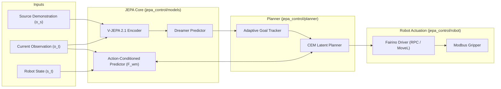

# JEPA World Model Control: One-Shot Visual Imitation Learning for Industrial Manipulators

[](https://opensource.org/licenses/Apache-2.0)
[](https://www.python.org/)
[](https://pytorch.org/)

**JEPA World Model Control** is a modular framework for cross-embodiment visual imitation learning on robotic manipulators (such as the Fairino FR10), built on Joint-Embedding Predictive Architectures (JEPA).

Rather than aligning embodiment-specific actions, the framework views demonstrations as implicit future goal specifications. Given a visual demonstration (from humans or other robots), the **Dreamer Predictor** infers embodiment-compatible future latent goals. The robot then executes continuous actions using a **Cross-Entropy Method (CEM) planner** operating within a learned **Action-Conditioned World Model**.

---

## 🏗️ Architecture Overview



---

## 📁 Repository Structure

```text
jepa-world-model-control/
├── config/
│   ├── deploy_config.yaml         # Model, checkpoint, and planner settings
│   └── fairino_robot.yaml         # Controller IP, speed limits, and coordinate bounds
├── jepa_control/
│   ├── models/                    # Core JEPA neural networks (V-JEPA, Dreamer, AC-Predictor)
│   ├── planner/                   # Latent-space Cross-Entropy Method optimizer
│   ├── perception/                # Image preprocessing, patch extraction & transforms
│   ├── robot/                     # Fairino FR10 XML-RPC driver with Dry-Run / Mock mode
│   └── pipeline/                  # Closed-loop execution engine
├── scripts/
│   ├── run_offline_rollout.py     # Offline demonstration replay & action generation
│   └── test_fairino_dry_run.py    # Hardware test & mock validation script
├── pyproject.toml
└── requirements.txt
```

---

## 🚀 Quickstart

### 1. Installation
```bash
# Clone the repository
git clone https://github.com/your-username/jepa-world-model-control.git
cd jepa-world-model-control

# Create & activate environment
python3 -m venv .venv
source .venv/bin/activate

# Install dependencies
pip install -r requirements.txt
pip install -e .
```

### 2. Offline Simulation / Mock Verification
You can test the entire pipeline without physical robot hardware using mock mode:
```bash
# Test the Fairino driver in simulated dry-run mode
python scripts/test_fairino_dry_run.py --mock

# Run end-to-end latent planning on a recorded demonstration
python scripts/run_offline_rollout.py --config config/deploy_config.yaml
```

### 3. Physical Lab Deployment (Fairino FR10)
Connect the control PC to the Fairino controller (`192.168.57.2`):
```bash
# Test live robot connection
python scripts/test_fairino_dry_run.py --ip 192.168.57.2

# Run visual imitation policy
python scripts/run_offline_rollout.py --config config/deploy_config.yaml --live
```

---

## 📜 License
This project is open-source under the [Apache 2.0 License](LICENSE).
